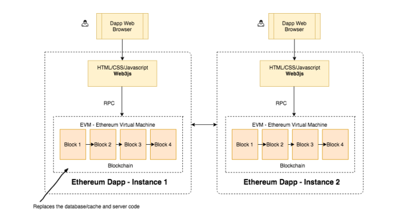

# Ethereum For Web Developers

Dapps remove the need for a trusted third party.

Ethereum acts as both a database and container of application code. Code written in Solidity is deployed directly to the blockchain. Web3.js is a library used to connect to a blockchain node.

